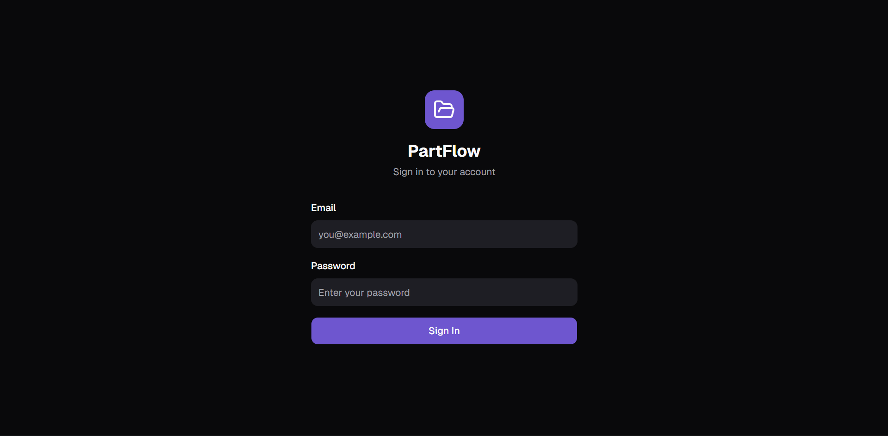
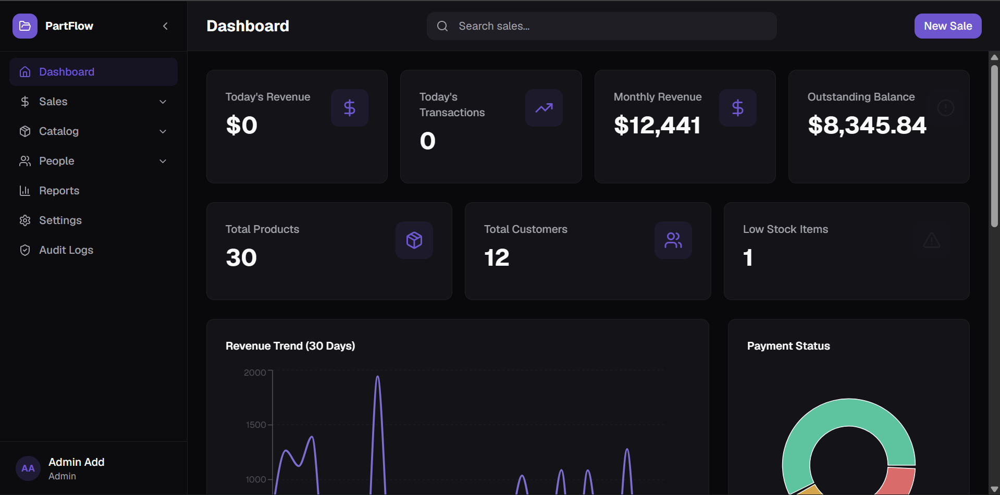
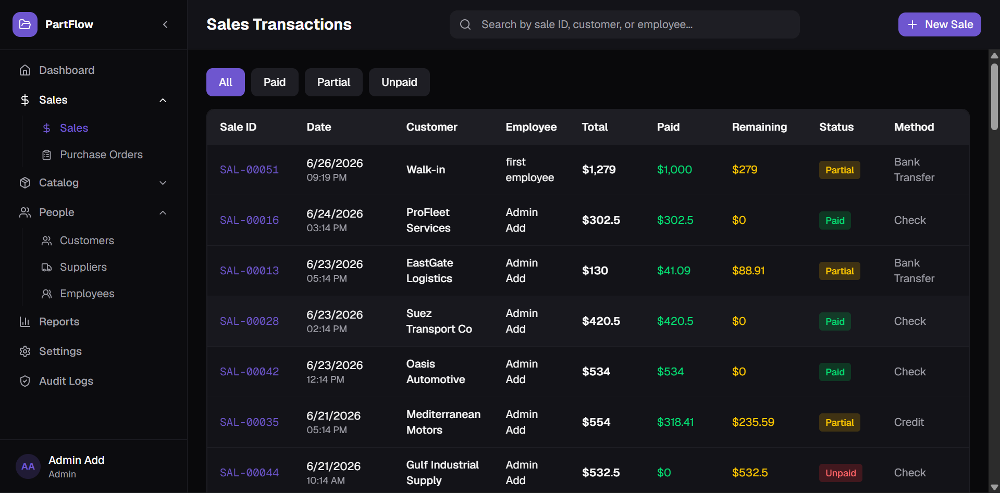
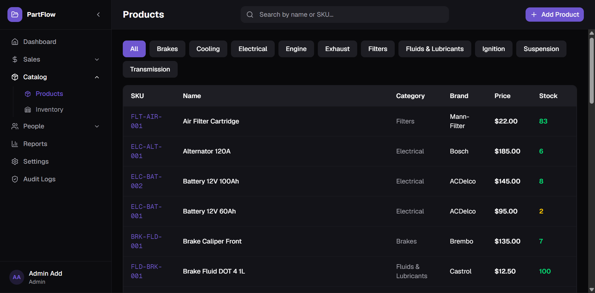
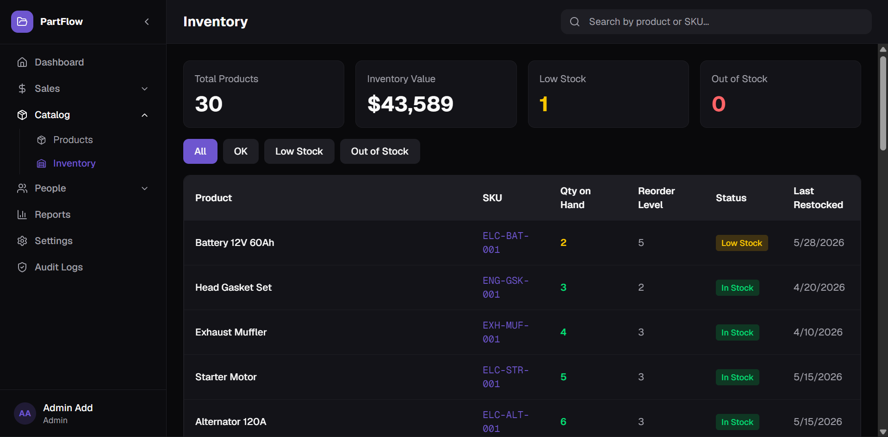
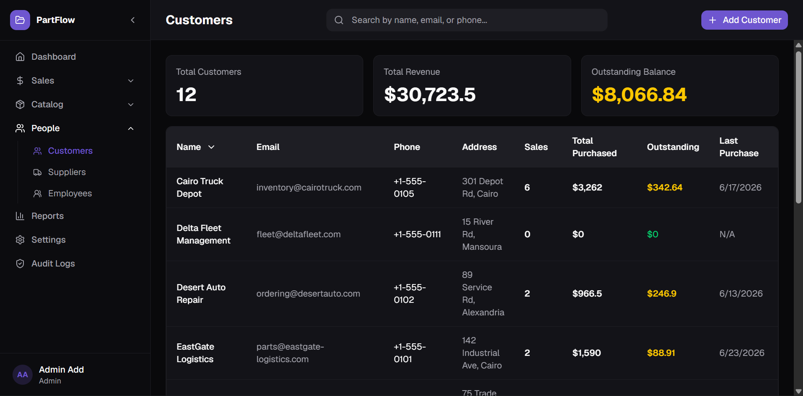
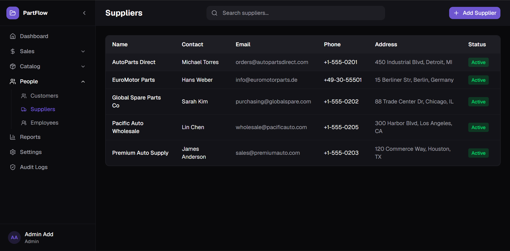
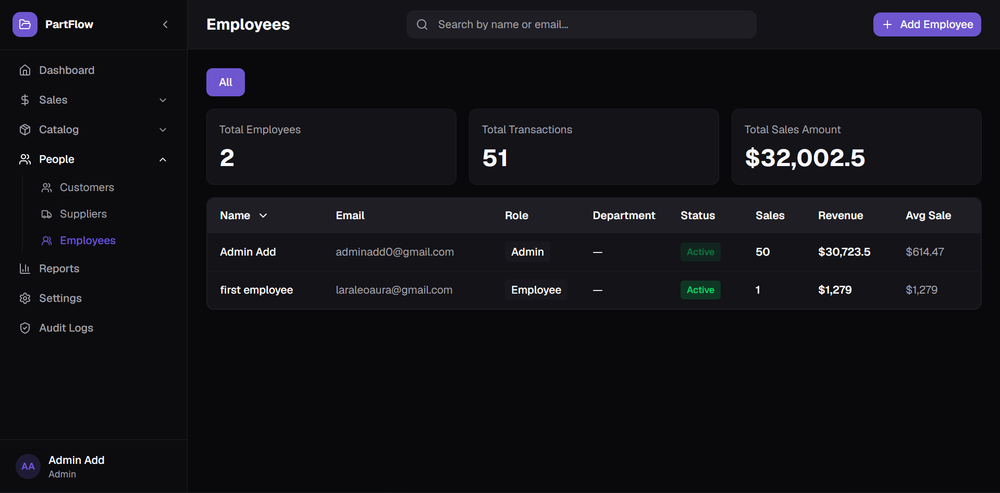

# PartFlow

A modern cloud-based spare parts management system built with **Next.js** and **Supabase**. PartFlow replaces spreadsheets and manual record-keeping with a centralized platform for managing inventory, sales, customers, suppliers, employees, and business reporting.

---

## Features

* Secure authentication with Supabase Auth
* Role-based access for Admin and Employee accounts
* Product and inventory management
* Sales transaction processing with automatic stock updates
* Customer and supplier management
* Purchase order workflow
* Interactive dashboard with business analytics
* Audit logging and activity tracking

---

## Tech Stack

* **Framework:** Next.js 16 (App Router)
* **Language:** TypeScript
* **Database:** Supabase (PostgreSQL)
* **Authentication:** Supabase Auth
* **Styling:** Tailwind CSS 4 + shadcn/ui
* **Charts:** Recharts
* **Icons:** Lucide React
* **Package Manager:** pnpm

---

## Project Structure

```text
app/            Application routes
components/     Shared UI components
lib/            Business logic and Supabase utilities
```

---

## Screenshots

## 📸 Screenshots

### 🔐 Authentication


### 📊 Dashboard


### 💰 Sales


### 📦 Products


### 📉 Inventory


### 👥 Customers


### 🚚 Suppliers


### 🧑‍💼 Employees



---

## Future Improvements

* Barcode scanning support
* Purchase approval workflow
* Multi-store inventory management
* Email notifications
* Advanced reporting and exports

---

Developed as a portfolio project demonstrating full-stack application development using Next.js and Supabase.
